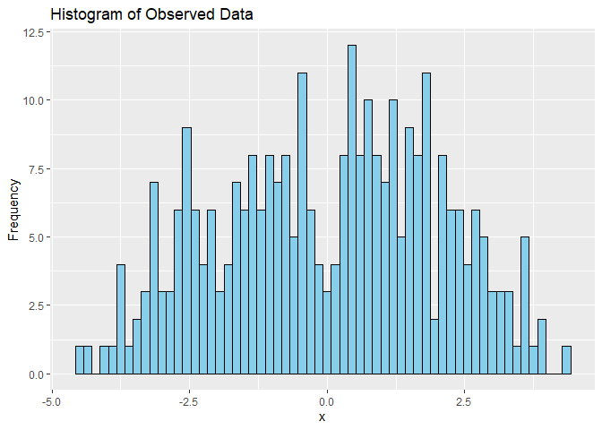
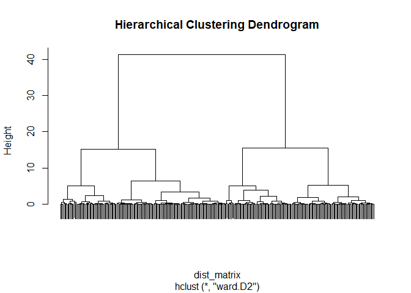
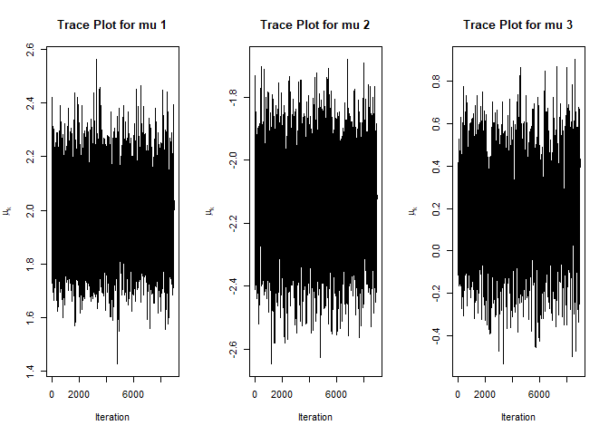
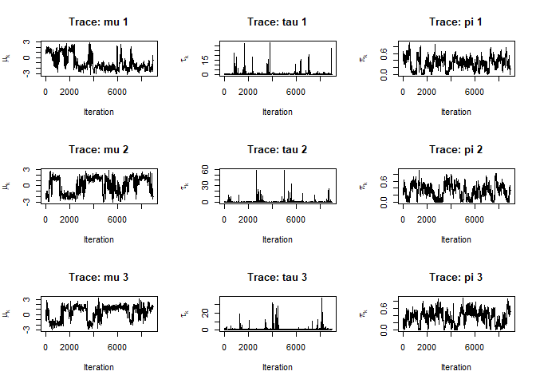
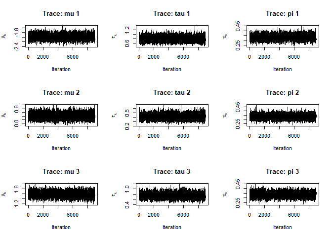
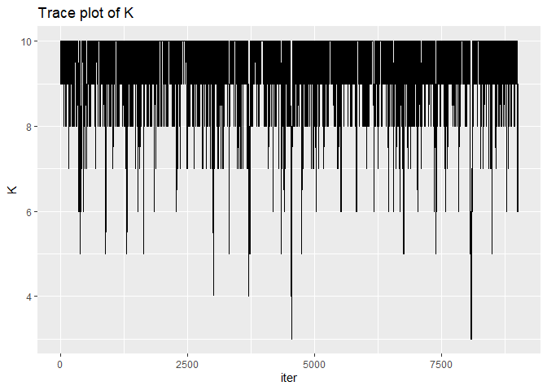
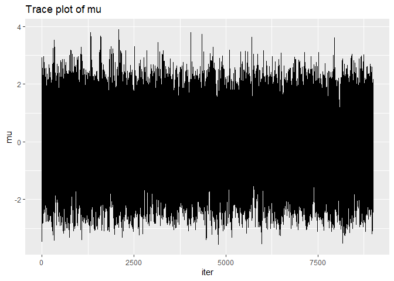
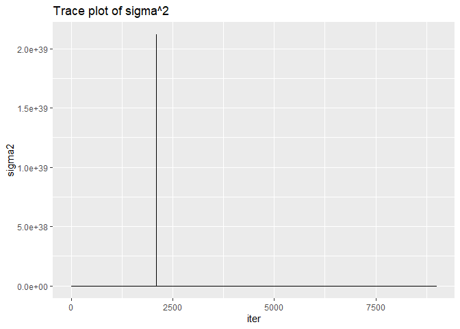
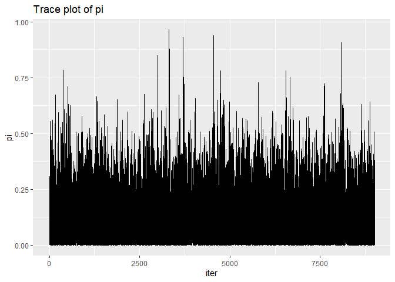

# STAT6011 Assignment 2
Lee Lap San 3036373312
2025-11-02

## Question 1

### a

``` r
# Load necessary libraries
library(ggplot2)
```

    Warning: package 'ggplot2' was built under R version 4.4.2

``` r
library(cluster)

# Load the dataset
data <- read.csv("q1.csv")

# Assuming the data is in a column named 'x'
x <- data$y

## a
# 1. Visualize the data using a histogram
ggplot(data, aes(x = x)) +
  geom_histogram(binwidth = 0.15, fill = "skyblue", color = "black") +
  labs(title = "Histogram of Observed Data", x = "x", y = "Frequency")
```



As shown in the histogram, there appears to be four peaks. We make a
guess that there are 4 clusters. We estimate
$\{\mu_k, \sigma_k\}_{k=1}^4$ by sample statistics.

``` r
# 2. Apply hierarchical clustering
# First, reshape the data for clustering
x_matrix <- matrix(x, ncol = 1)

# Compute the distance matrix
dist_matrix <- dist(x_matrix)

# Perform hierarchical clustering
hc <- hclust(dist_matrix, method = "ward.D2")

# Plot the dendrogram
plot(hc, labels = FALSE, main = "Hierarchical Clustering Dendrogram")
```



``` r
# Cut the tree to guess K (e.g., try 2 to 5 clusters)
K_guess <- 4  # Guess
clusters <- cutree(hc, k = K_guess)

# Estimate parameters for each cluster
for (k in 1:K_guess) {
  cluster_data <- x[clusters == k]
  mu_k <- mean(cluster_data)
  sigma_k <- sd(cluster_data)
  cat(sprintf("Cluster %d: Mean = %.2f, SD = %.2f\n", k, mu_k, sigma_k))
}
```

    Cluster 1: Mean = 0.99, SD = 0.54
    Cluster 2: Mean = 2.80, SD = 0.57
    Cluster 3: Mean = -0.94, SD = 0.48
    Cluster 4: Mean = -2.80, SD = 0.63

### b

We consider a Bayesian Gaussian mixture model with a number of
components $K$. Each observation $x_i$ is modeled as:

where $\pi_k$ are the mixing proportions such that
$\sum_{k=1}^K \pi_k = 1$, and $\mu_k, \sigma_k^2$ are the mean and
variance of the $k$-th component. We introduce latent allocation
variables $z_i \in \{1, \dots, K\}$ such that:

The complete-data likelihood is:

The prior distributions are:

Complete Conditional Distributions These arise from the conjugacy
between the priors and the likelihoods Conditional for $z_i$:

Conditional for $\mu_k$: Given the normal prior and normal likelihood:

Conditional for $\tau_k$: Given the Gamma prior and normal likelihood:

Conditional for $\pi$: Given the Dirichlet prior and categorical
likelihood:

### c

``` r
## c
n <- length(x)
K <- 3
sigma2 <- rep(1, K)
pi_k <- rep(1/K, K)

# Initialize parameters
mu <- rnorm(K, 0, 1)
z <- sample(1:K, n, replace = TRUE)

# Gibbs sampling settings
n_iter <- 10000
burn_in <- 1000
mu_samples <- matrix(NA, nrow = n_iter, ncol = K)

# Gibbs sampler
for (iter in 1:n_iter) {
  # Step 1: Sample z_i
  for (i in 1:n) {
    probs <- sapply(1:K, function(k) {
      dnorm(x[i], mean = mu[k], sd = sqrt(sigma2[k])) * pi_k[k]
    })
    z[i] <- sample(1:K, 1, prob = probs / sum(probs))
  }
  
  # Step 2: Sample mu_k
  for (k in 1:K) {
    x_k <- x[z == k]
    n_k <- length(x_k)
    if (n_k > 0) {
      x_bar_k <- mean(x_k)
      post_var <- 1 / (n_k + 1)
      post_mean <- n_k * x_bar_k * post_var
      mu[k] <- rnorm(1, mean = post_mean, sd = sqrt(post_var))
    } else {
      mu[k] <- rnorm(1, 0, 1)  # fallback if no data assigned
    }
  }
  
  mu_samples[iter, ] <- mu
}

# Remove burn-in
mu_samples_post <- mu_samples[(burn_in + 1):n_iter, ]

# Posterior summaries
posterior_means <- colMeans(mu_samples_post)
posterior_vars <- apply(mu_samples_post, 2, var)

cat("Posterior Means:\n")
```

    Posterior Means:

``` r
print(posterior_means)
```

    [1]  1.9797887 -2.1350702  0.1792617

``` r
cat("Posterior Variances:\n")
```

    Posterior Variances:

``` r
print(posterior_vars)
```

    [1] 0.01712577 0.01702366 0.03878059

``` r
# Trace plots
par(mfrow = c(1, 3))
for (k in 1:K) {
  plot(mu_samples_post[, k], type = "l", main = paste("Trace Plot for mu", k),
       xlab = "Iteration", ylab = expression(mu[k]))
}
```



### d

``` r
# Load necessary libraries
library(ggplot2)
library(MCMCpack)  # for Dirichlet sampling
```

    Warning: package 'MCMCpack' was built under R version 4.4.3

    Loading required package: coda

    Warning: package 'coda' was built under R version 4.4.3

    Loading required package: MASS

    Warning: package 'MASS' was built under R version 4.4.2

    ##
    ## Markov Chain Monte Carlo Package (MCMCpack)

    ## Copyright (C) 2003-2026 Andrew D. Martin, Kevin M. Quinn, and Jong Hee Park

    ##
    ## Support provided by the U.S. National Science Foundation

    ## (Grants SES-0350646 and SES-0350613)
    ##

``` r
n <- length(x)
K <- 3

# Priors
mu_prior_mean <- 0
mu_prior_var <- 1
tau_shape <- 0.1
tau_rate <- 0.1
alpha_pi <- rep(1, K)

# Initialization
set.seed(123)
z <- sample(1:K, n, replace = TRUE)
mu <- rnorm(K, mu_prior_mean, sqrt(mu_prior_var))
tau <- rgamma(K, tau_shape, rate = tau_rate)
pi <- rdirichlet(1, alpha_pi)[1, ]

# Storage
n_iter <- 10000
burn_in <- 1000
mu_samples <- matrix(NA, nrow = n_iter, ncol = K)
tau_samples <- matrix(NA, nrow = n_iter, ncol = K)
pi_samples <- matrix(NA, nrow = n_iter, ncol = K)

# Gibbs sampler
for (iter in 1:n_iter) {
  # Step 1: Sample z_i
  for (i in 1:n) {
    probs <- sapply(1:K, function(k) {
      pi[k] * dnorm(x[i], mean = mu[k], sd = sqrt(1 / tau[k]))
    })
    z[i] <- sample(1:K, 1, prob = probs / sum(probs))
  }
  
  # Step 2: Sample mu_k
  for (k in 1:K) {
    x_k <- x[z == k]
    n_k <- length(x_k)
    if (n_k > 0) {
      post_var <- 1 / (tau[k] * n_k + 1 / mu_prior_var)
      post_mean <- post_var * (tau[k] * sum(x_k))
      mu[k] <- rnorm(1, post_mean, sqrt(post_var))
    } else {
      mu[k] <- rnorm(1, mu_prior_mean, sqrt(mu_prior_var))
    }
  }
  
  # Step 3: Sample tau_k
  for (k in 1:K) {
    x_k <- x[z == k]
    n_k <- length(x_k)
    shape_post <- tau_shape + n_k / 2
    rate_post <- tau_rate + 0.5 * sum((x_k - mu[k])^2)
    tau[k] <- rgamma(1, shape_post, rate_post)
  }
  
  # Step 4: Sample pi
  n_k <- table(factor(z, levels = 1:K))
  pi <- rdirichlet(1, alpha_pi + n_k)[1, ]
  
  # Store samples
  mu_samples[iter, ] <- mu
  tau_samples[iter, ] <- tau
  pi_samples[iter, ] <- pi
}

# Remove burn-in
mu_post <- mu_samples[(burn_in + 1):n_iter, ]
tau_post <- tau_samples[(burn_in + 1):n_iter, ]
pi_post <- pi_samples[(burn_in + 1):n_iter, ]

# Posterior summaries
posterior_summary <- function(samples) {
  apply(samples, 2, function(x) c(mean = mean(x), var = var(x)))
}

cat("Posterior Means and Variances for mu_k:\n")
```

    Posterior Means and Variances for mu_k:

``` r
print(posterior_summary(mu_post))
```

               [,1]      [,2]      [,3]
    mean -0.8995712 0.1335908 0.4224397
    var   1.8930121 2.0339179 1.6999266

``` r
cat("Posterior Means and Variances for tau_k:\n")
```

    Posterior Means and Variances for tau_k:

``` r
print(posterior_summary(tau_post))
```

              [,1]     [,2]      [,3]
    mean 0.9220433 1.071718 0.9310972
    var  1.6964908 4.142169 2.5565035

``` r
cat("Posterior Means and Variances for pi_k:\n")
```

    Posterior Means and Variances for pi_k:

``` r
print(posterior_summary(pi_post))
```

               [,1]       [,2]       [,3]
    mean 0.32728274 0.31287988 0.35983738
    var  0.02986876 0.03609983 0.03602008

``` r
# Trace plots
par(mfrow = c(3, 3))
for (k in 1:K) {
  plot(mu_post[, k], type = "l", main = paste("Trace: mu", k), xlab = "Iteration", ylab = expression(mu[k]))
  plot(tau_post[, k], type = "l", main = paste("Trace: tau", k), xlab = "Iteration", ylab = expression(tau[k]))
  plot(pi_post[, k], type = "l", main = paste("Trace: pi", k), xlab = "Iteration", ylab = expression(pi[k]))
}
```



### e

Variational Family Assumption In mean-field variational Bayes (MFVB), we
approximate the true posterior distribution with a factorized
variational distribution: where: We then compute the conditional of
$\pi_k$ by since $a_k$ follows a multinominal distribution with
Dirichlet prior.

Expectations Required for Updates To update the variational parameters,
we take expectations under the current variational distributions. 1.
Expectation of Log Precision $\mathbb{E}[\log \tau_k]$ Given
$\tau_k \sim \text{Gamma}(a_k, b_k)$, the expectation is: where $\psi$
is the digamma function.

2.  Expectation of Precision $\mathbb{E}[\tau_k]$

3.  Expectation of Quadratic Term $\mathbb{E}[(x_i - \mu_k)^2]$ Given
    $\mu_k \sim \mathcal{N}(m_k, s_k^2)$, we compute: These are used in
    the update of $\phi_{ik}$.

4.  Update of \$ \_{ik} \$ Using the expectations above, we compute:
    Then normalize:

5.  Update of $\mu_k$ Variational Parameters Let
    $N_k = \sum_{i=1}^n \phi_{ik}$, and
    $\bar{x}_k = \frac{1}{N_k} \sum_{i=1}^n \phi_{ik} x_i$. Then,

6.  Update of $\tau_k$ Variational Parameters

These expectations and updates form the core of the coordinate ascent
algorithm in mean-field variational Bayes for Gaussian mixture models.

``` r
## e
# Load necessary libraries
library(MCMCpack)  # for rdirichlet

x <- data$y
n <- length(x)
K <- 3

# Initialize variational parameters
set.seed(123)
phi <- matrix(1/K, nrow = n, ncol = K)  # phi[i, k] = q(z_i = k)
mu_mean <- rnorm(K, 0, 1)
mu_var <- rep(1, K)
tau_shape <- rep(1, K)
tau_rate <- rep(1, K)
alpha_prior <- rep(1, K)

# Variational Bayes iterations
max_iter <- 1000
for (iter in 1:max_iter) {
  # E-step: Update phi_{i,k}
  for (i in 1:n) {
    for (k in 1:K) {
      E_log_tau <- digamma(tau_shape[k]) - log(tau_rate[k])
      E_tau <- tau_shape[k] / tau_rate[k]
      log_phi_ik <- 0.5 * E_log_tau -
        0.5 * E_tau * (x[i]^2 - 2 * x[i] * mu_mean[k] + mu_mean[k]^2 + mu_var[k])
      phi[i, k] <- log_phi_ik
    }
    phi[i, ] <- exp(phi[i, ] - max(phi[i, ]))  # numerical stability
    phi[i, ] <- phi[i, ] / sum(phi[i, ])
  }
  
  # M-step: Update q(mu_k), q(tau_k)
  Nk <- colSums(phi)
  for (k in 1:K) {
    x_bar_k <- sum(phi[, k] * x) / Nk[k]
    mu_var[k] <- 1 / (Nk[k] * (tau_shape[k] / tau_rate[k]) + 1)
    mu_mean[k] <- mu_var[k] * (tau_shape[k] / tau_rate[k]) * Nk[k] * x_bar_k
    sq_diff <- (x - mu_mean[k])^2 + mu_var[k]
    tau_shape[k] <- 0.1 + 0.5 * Nk[k]
    tau_rate[k] <- 0.1 + 0.5 * sum(phi[, k] * sq_diff)
  }
  
  # Update pi using its complete conditional posterior
  pi <- as.numeric(rdirichlet(1, alpha_prior + Nk))
}

# Print final variational parameters
cat("\nFinal Variational Parameters:\n")
```


    Final Variational Parameters:

``` r
cat("\nmu_mean:\n")
```


    mu_mean:

``` r
print(mu_mean)
```

    [1] -1.9808948  0.4165634  1.5778756

``` r
cat("\nmu_var:\n")
```


    mu_var:

``` r
print(mu_var)
```

    [1] 0.01249628 0.02407745 0.01333650

``` r
cat("\ntau_shape:\n")
```


    tau_shape:

``` r
print(tau_shape)
```

    [1] 49.99546 49.80634 50.49821

``` r
cat("\ntau_rate:\n")
```


    tau_rate:

``` r
print(tau_rate)
```

    [1]  63.13405 122.15788  68.80084

``` r
cat("\nphi (first 5 rows):\n")
```


    phi (first 5 rows):

``` r
print(round(phi[1:5, ], 4))  # show first 5 data points' responsibilities
```

           [,1]   [,2]   [,3]
    [1,] 0.0654 0.5040 0.4305
    [2,] 0.0001 0.2869 0.7130
    [3,] 0.0010 0.3150 0.6840
    [4,] 0.0062 0.3744 0.6194
    [5,] 0.0000 0.2890 0.7109

``` r
cat("\nEstimated posterior Dirichlet parameters for pi:\n")
```


    Estimated posterior Dirichlet parameters for pi:

``` r
print(alpha_prior + colSums(phi))
```

    [1] 100.7909 100.4127 101.7964

``` r
# Generate posterior samples
n_samples <- 10000
burn_in <- 1000
mu_samples <- matrix(NA, nrow = n_samples, ncol = K)
tau_samples <- matrix(NA, nrow = n_samples, ncol = K)
pi_samples <- matrix(NA, nrow = n_samples, ncol = K)

for (s in 1:n_samples) {
  for (k in 1:K) {
    mu_samples[s, k] <- rnorm(1, mu_mean[k], sqrt(mu_var[k]))
    tau_samples[s, k] <- rgamma(1, tau_shape[k], rate = tau_rate[k])
  }
  Nk <- colSums(phi)
  pi_samples[s, ] <- rdirichlet(1, alpha_prior + Nk)[1, ]
}

# Remove burn-in
mu_post <- mu_samples[(burn_in + 1):n_samples, ]
tau_post <- tau_samples[(burn_in + 1):n_samples, ]
pi_post <- pi_samples[(burn_in + 1):n_samples, ]

# Posterior summaries
posterior_summary <- function(samples) {
  apply(samples, 2, function(x) c(mean = mean(x), var = var(x)))
}

cat("Posterior Means and Variances for mu_k:\n")
```

    Posterior Means and Variances for mu_k:

``` r
print(posterior_summary(mu_post))
```

                [,1]      [,2]       [,3]
    mean -1.97977347 0.4173104 1.57722912
    var   0.01231286 0.0243270 0.01304494

``` r
cat("Posterior Means and Variances for tau_k:\n")
```

    Posterior Means and Variances for tau_k:

``` r
print(posterior_summary(tau_post))
```

               [,1]        [,2]       [,3]
    mean 0.79235266 0.408651521 0.73642748
    var  0.01261563 0.003437997 0.01058379

``` r
cat("Posterior Means and Variances for pi_k:\n")
```

    Posterior Means and Variances for pi_k:

``` r
print(posterior_summary(pi_post))
```

                 [,1]         [,2]         [,3]
    mean 0.3330924029 0.3313196593 0.3355879379
    var  0.0007287744 0.0007440722 0.0007269795

``` r
# Trace plots
par(mfrow = c(3, 3))
for (k in 1:K) {
  plot(mu_post[, k], type = "l", main = paste("Trace: mu", k), xlab = "Iteration", ylab = expression(mu[k]))
  plot(tau_post[, k], type = "l", main = paste("Trace: tau", k), xlab = "Iteration", ylab = expression(tau[k]))
  plot(pi_post[, k], type = "l", main = paste("Trace: pi", k), xlab = "Iteration", ylab = expression(pi[k]))
}
```



### f

We apply the birth or death approach with acceptance probability

``` r
# RJMCMC for Gaussian Mixtures with Birth/Death Acceptance Ratio

rjmcmc_gmm_birth_death <- function(x, k_max = 10, n_iter = 10000, burn_in = 1000) {
  N <- length(x)
  K <- 1
  z <- rep(1, N)
  mu <- rnorm(1, 0, 1)
  tau <- rgamma(1, shape = 0.1, rate = 0.1)
  pi <- 1

  samples <- list(k = numeric(n_iter), mu = list(), tau = list(), pi = list(), z = list())

  for (iter in 1:n_iter) {
    # Update z_i
#    probs <- sapply(1:K, function(k) pi[k] * dnorm(x, mean = mu[k], sd = sqrt(1 / tau[k])))
#    probs <- t(probs)
#    z <- sapply(1:N, function(i) {
#    p <- probs[i, ]
#    p <- p / sum(p)  # Normalize to ensure valid probabilities
#    sample(1:K, 1, prob = p)
#    })
    for (i in 1:N) {
      probs <- sapply(1:K, function(k) {
        pi[k] * dnorm(x[i], mean = mu[k], sd = sqrt(1 / tau[k]))
      })
      z[i] <- sample(1:K, 1, prob = probs / sum(probs))
    }

    # Update mu_k and tau_k
    mu_new <- numeric(K)
    tau_new <- numeric(K)
    nk <- table(factor(z, levels = 1:K))
    for (k in 1:K) {
      xk <- x[z == k]
      nk_k <- length(xk)
      tau_k <- tau[k]
      mu_k <- rnorm(1, mean = (tau_k * sum(xk)) / (tau_k * nk_k + 1),
                    sd = sqrt(1 / (tau_k * nk_k + 1)))
      mu_new[k] <- mu_k

      shape <- 0.1 + nk_k / 2
      rate <- 0.1 + 0.5 * sum((xk - mu_k)^2)
      tau_new[k] <- rgamma(1, shape = shape, rate = rate)
    }
    mu <- mu_new
    tau <- tau_new

    # Update pi
    alpha <- rep(1, K)
    pi <- as.numeric(rdirichlet(1, alpha + nk))

    # RJMCMC move: birth or death
    b_k <- ifelse(K < k_max, 0.5, 0)
    d_k <- ifelse(K > 1, 0.5, 0)

    if (runif(1) < b_k) {
      # Birth move
      w_new <- rbeta(1, 1, K)
      mu_new <- rnorm(1, 0, 1)
      tau_new <- rgamma(1, 0.1, 0.1)

      # Rescale existing weights to make space
      pi <- pi * (1 - w_new)
      pi <- c(pi, w_new)
      pi <- pi / sum(pi)

      mu <- c(mu, mu_new)
      tau <- c(tau, tau_new)
      K <- K + 1
    } else if (runif(1) < d_k && K > 1) {
      # Death move
      empty <- which(table(factor(z, levels = 1:K)) == 0)
      if (length(empty) > 0) {
        j <- sample(empty, 1)

        # Remove the empty component and rescale weights
        pi <- pi[-j]
        pi <- pi / sum(pi)
        mu <- mu[-j]
        tau <- tau[-j]
        K <- K - 1
      }
    }

    # Store samples
    samples$k[iter] <- K
    samples$mu[[iter]] <- mu
    samples$tau[[iter]] <- tau
    samples$pi[[iter]] <- pi
    samples$z[[iter]] <- z
  }

  # Remove burn-in
  samples$k <- samples$k[(burn_in + 1):n_iter]
  samples$mu <- samples$mu[(burn_in + 1):n_iter]
  samples$tau <- samples$tau[(burn_in + 1):n_iter]
  samples$pi <- samples$pi[(burn_in + 1):n_iter]
  samples$z <- samples$z[(burn_in + 1):n_iter]

  return(samples)
}

# Dirichlet sampler
rdirichlet <- function(n, alpha) {
  MCMCpack::rdirichlet(n, alpha)
}
```

``` r
# Posterior summaries and trace plots
summarize_and_plot <- function(samples) {
  cat("Posterior mean of K:", mean(samples$k), "
")
  cat("Posterior variance of K:", var(samples$k), "
")

  mu_flat <- unlist(samples$mu)
  tau_flat <- unlist(samples$tau)
  pi_flat <- unlist(samples$pi)

  cat("Posterior mean of mu:", mean(mu_flat), "
")
  cat("Posterior variance of mu:", var(mu_flat), "
")
  cat("Posterior mean of sigma^2:", mean(1 / tau_flat), "
")
  cat("Posterior variance of sigma^2:", var(1 / tau_flat), "
")
  cat("Posterior mean of pi:", mean(pi_flat), "
")
  cat("Posterior variance of pi:", var(pi_flat), "
")

  if (requireNamespace("ggplot2", quietly = TRUE)) {
    library(ggplot2)
    df_k <- data.frame(iter = 1:length(samples$k), K = samples$k)
    print(ggplot(df_k, aes(x = iter, y = K)) + geom_line() + ggtitle("Trace plot of K"))

    df_mu <- data.frame(iter = rep(1:length(samples$mu), sapply(samples$mu, length)),
                        mu = unlist(samples$mu))
    print(ggplot(df_mu, aes(x = iter, y = mu)) + geom_line() + ggtitle("Trace plot of mu"))

    df_sigma2 <- data.frame(iter = rep(1:length(samples$tau), sapply(samples$tau, length)),
                            sigma2 = 1 / unlist(samples$tau))
    print(ggplot(df_sigma2, aes(x = iter, y = sigma2)) + geom_line() + ggtitle("Trace plot of sigma^2"))

    df_pi <- data.frame(iter = rep(1:length(samples$pi), sapply(samples$pi, length)),
                        pi = unlist(samples$pi))
    print(ggplot(df_pi, aes(x = iter, y = pi)) + geom_line() + ggtitle("Trace plot of pi"))
  }
}
```

``` r
set.seed(123)
samples <- rjmcmc_gmm_birth_death(x)
summarize_and_plot(samples)
```

    Posterior mean of K: 9.311444 
    Posterior variance of K: 0.9712214 
    Posterior mean of mu: -0.01826216 
    Posterior variance of mu: 1.638659 
    Posterior mean of sigma^2: 2.527182e+34 
    Posterior variance of sigma^2: 5.352144e+73 
    Posterior mean of pi: 0.1073947 
    Posterior variance of pi: 0.01236771 








